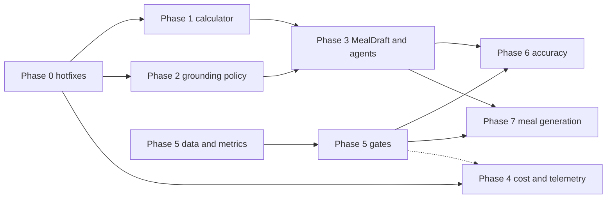

# AI Calorie Pipeline Remediation Plan

> Status: **IMPLEMENTED (2026-09-25), with the explicit pending items below.** This
> status reflects the current implementation; the original audit and plan are retained
> below for traceability. Planned behavior is not described as shipped unless listed as
> implemented here.
> Scope: every path that derives, analyzes, or commits calories — photo scan,
> natural-language logging, describe-food/label parsing, the Coach agent, MCP agents —
> plus a grounded meal-suggestion capability.

## Status (implemented)

Status and evidence for each numbered plan item. “Partial” means the implementation exists
but the plan's data, review, or rollout condition remains open.

| Item | Status | Implementing files / tests |
|---|---|---|
| 0.1 Scan confirmation recomputes | Implemented | `MealDraftService.cs`, `MealDraftEndpoints.cs`, `NutritionCalculator.cs`; `MealDraftContractTests.cs`, `MealDraftServiceTests.cs` |
| 0.2 Web hit does not crash scan | Implemented | `MealScanService.cs`; `MealScanServiceWebCascadeTests.cs` |
| 0.3 Truthful provenance | Implemented | `Dtos.cs`, meal draft/daily-summary services; `MealDraftContractTests.cs`, `MealContractTests.cs` |
| 0.4 Historical scan repair | Implemented | `backend/tools/ScanMealRepair/ScanMealRepairPlanner.cs` |
| 0.5 Backend checks in GitHub CI | Implemented | `.github/workflows/ci.yml` |
| 0.6 Secret hygiene | Implemented | `backend/src/GutAI.Api/appsettings.Production.json`, `docs/DEPLOYMENT.md` |
| 1.1 Shared nutrition calculator | Implemented | `NutritionCalculator.cs`, `frontend/src/utils/nutrition.ts`; `NutritionCalculatorTests.cs` and frontend utility tests |
| 1.2 Product-linked create/update recomputation | Implemented | `MealEndpoints.cs`, `NutritionCalculator.cs`, `NutritionSanity.cs`; `MealContractTests.cs` |
| 1.3 Shared sanity checks | Implemented | `Application/Common/Helpers/NutritionSanity.cs`; `NutritionSanityTests.cs` |
| 1.4 Web cascade hardening | Partial | `WebNutritionCascade.cs`; `Features:WebGrounding` remains off pending legal/source review (D6) |
| 1.5 Contract checker scan DTOs | Implemented | `scripts/check-contracts.js`, scan/draft DTOs; `make check-contracts` |
| 2.1 GroundingPolicy | Implemented | `GroundingPolicy.cs`; `GroundingPolicyTests.cs` |
| 2.2 Shared consumers and NLP ambiguity behavior | Implemented | `ComponentGroundingEngine.cs`, `AgentMealItemResolver.cs`, `NaturalLanguageFallbackService.cs`, describe-food service; `GroundingPolicyTests.cs`, `AgentMealItemResolverTests.cs` |
| 2.3 Honest identity confidence | Implemented | `AgentMealItemResolver.cs`, Coach and MCP meal tools; `AgentMealItemResolverTests.cs` |
| 2.4 Shared AgentMealItemResolver | Implemented | `AgentMealItemResolver.cs`, Coach and MCP tools; `AgentMealItemResolverTests.cs` |
| 2.5 Reanalysis preserves Stage-A grams | Implemented | `MealScanAgentReviewService.cs`; `MealScanAgentReviewServiceTests.cs` |
| 3.1 MealDraft replaces ScanSession | Implemented | `MealDraftRecord.cs`, `MealDraftService.cs`, `MealDraftEndpoints.cs`, `TableStorageStore.cs`; `MealDraftRoundtripTests.cs` |
| 3.2 Coach propose/guarded commit | Implemented | `CoachChatService.cs`, `MealDraftCommitGuard`; Coach eval suite |
| 3.3 Coach session state | Implemented | Coach session-state implementation in `CoachChatService.cs`; AgentEvalHarness |
| 3.4 Coach prompt rewrite | Implemented | `CoachPrompts.cs`; AgentEvalHarness coach suite |
| 3.5 MCP propose/commit parity | Implemented | `MealSymptomTools.cs`, MCP draft tools; `McpLinkFlowTests.cs` |
| 3.6 NLP logging through drafts | Implemented | `NaturalLanguageFallbackService.cs`, `MealEndpoints.cs`, `LogMealSheet.tsx` (draft-only; an expired draft is re-analyzed, never logged via the create path); `NaturalLanguageFallbackServiceTests.cs`, `MealDraftContractTests.cs`, `mealMappers.test.ts` |
| 3.7 Shared review UI and chat cards | Implemented | `MealDraftReviewSheet.tsx`, chat draft cards, dashboard pending-draft inbox; frontend tests |
| 4.1 Per-workload chat clients | Implemented | `DependencyInjection.cs`, workload config; `GoldenScanHarness` workload setup |
| 4.2 Telemetry | Implemented | AI `ActivitySource`/`Meter`, `AiUsageMeter`, `Program.cs`, `infra/main.bicep`; `ScanUsageMeteringTests.cs` |
| 4.3 Batched B2 selection | Implemented | `MealScanCandidateSelectionStage.cs`, `MealScanCandidateSelector.cs`; `ScanUsageMeteringTests.cs` |
| 4.4 Coach budgets | Implemented | `CoachChatService.cs`, `CoachPrompts.cs`; AgentEvalHarness coach suite |
| 4.5 Scan deadline and dedupe | Implemented | `MealScanService.cs`, `VisionResultCache.cs`; scan service tests |
| 4.6 Draft TTL and cleanup | Implemented | `MealDraftService.cs`, `MealDraftCleanupService.cs`; `MealDraftServiceTests.cs`, `MealDraftCleanupServiceTests.cs`, `MealDraftRoundtripTests.cs` purge |
| 5.1 Golden manifest v2 and data collection | Partial | `GoldenScanHarness/GoldenManifest.cs`, `golden-images/manifest.json`, `GoldenMetricsTests.cs`; manifest remains the cached 12-case set, not the planned weighed dataset. |
| 5.2 Golden metrics | Implemented | `GoldenMetrics.cs`, `ProductionGoldenE2e.cs`; `GoldenMetricsTests.cs` |
| 5.3 Gate and cache policy | Partial | `GoldenScanHarness/Program.cs`, `VisionResultCache.cs`, `golden-images/manifest.json`; `GoldenMetricsTests.cs`; thresholds are live-baselined from 6 refreshed runs (2026-09-26/27), including latency/cost thresholds, and remain provisional pending weighed data (D7). |
| 5.4 Scheduled CI evaluation | Superseded: manual runs | Evaluations run manually on demand per the product-owner decision of 2026-09-27; the scheduled GitHub workflow was removed. |
| 5.5 Correction analytics | Implemented | `CorrectionAnalytics.cs`, `backend/tools/CorrectionAnalytics/` |
| 5.6 Coach, describe-food and label evals | Implemented | `backend/tools/AgentEvalHarness/`, evaluation graders in `Infrastructure/Services/Evaluation`; `AgentEvalGraderTests.cs`; manual live runs |
| 6.1 Hidden calories | Implemented, default off | `MealScanService.cs`, Stage-A wire types/prompts; `MealScanServiceHiddenCaloriesTests.cs` |
| 6.2 Portion calibration | Implemented, default off | `PortionCalibrator.cs`, `FoodClassClassifier.cs`; `PortionCalibratorTests.cs` |
| 6.3 Personalization | Implemented | user profile persistence, `PreferredFoodRegion` and scan/Coach/NLP/MCP/web lookup call sites; `UserContractTests.cs` |
| 6.4 Calibrated B2/agent auto-selection | Implemented behind flags | `MealScan:RequireCompatibilityAgreement`, `MealScan:MultiQueryAutoSelect`, `MealScanCandidateSelector.cs`; selection tests |
| 6.5 Describe-food decomposition and grounding | Implemented | `ContentUnderstandingService.cs`, `GroundingPolicy.cs`, `NutritionSanity.cs`; AgentEvalHarness describe/label suites |
| 7.1 Meal suggestion service | Implemented, default off | `NutritionBudgetService.cs`, `MealSuggestionService.cs`, `SubstitutionService.cs`; `MealSuggestionServiceTests.cs` |
| 7.2 Suggestion surfaces | Implemented, default off | suggestion endpoints, Coach tool, dashboard sheet and chat cards; `MealSuggestionContractTests.cs`, AgentEvalHarness |
| 7.3 Suggestion metrics | Implemented | `MealSuggestionService.cs` and suggestion metrics; `MealSuggestionServiceTests.cs` |

### Deviations and implementation notes

- MCP uses a server-enforced minimum draft age (`Mcp:MinCommitDelaySeconds`, default 20 seconds), not the Coach turn-start guard. Coach still uses its own turn guard.
- NLP preview intentionally retains the top candidate for ambiguous input and marks it `needs_choice`; the server requires an explicit candidate choice (including keeping the preview), replacement food, or log-without-calories choice at commit, otherwise returning HTTP 422. `LogMealSheet` and `MealDraftReviewSheet` block saving until a choice is made.
- The scan deadline bounds analysis through enrichment, but final draft persistence deliberately uses the request cancellation token rather than the scan deadline token so completed analysis is not discarded at the last step.
- Draft state transitions use an ETag-conditional replace
  (`ITableStore.TryReplaceMealDraftAsync`), not read-then-upsert.
- Hidden calories use a separate `inferred_components` list and prompt-version suffix;
  when disabled, the v11 Stage-A schema remains byte-identical.
- Golden quality thresholds are live-baselined from 6 refreshed runs (2026-09-26/27),
  pending weighed-meal data (D7); the planned ≥50-case weighed dataset is not yet available.
  Latency and cost thresholds are set from the same live baseline and remain provisional
  pending weighed data (D7). Evaluations are run manually by product-owner decision
  (2026-09-27).


## Summary
| Phase | Theme | Status |
|---|---|---|
| 0 | Stop silent calorie corruption | Complete: recomputation, provenance, repair, CI checks, secret hygiene |
| 1 | One nutrition calculator, server-authoritative | Mostly complete: calculator/sanity shipped; web grounding disabled pending review |
| 2 | One grounding policy for every surface | Complete: shared policy/resolver, immutable Stage-A grams, opt-in query expansion |
| 3 | Agents propose, humans commit (`MealDraft`) | Complete: draft lifecycle, Coach/MCP/NLP cutover, review UI and undo |
| 4 | Cost, latency, observability | Complete: workloads, telemetry, batched selection, budgets, deadline/cache, TTL |
| 5 | Evaluation and learning loop | Partial: v2 metrics and manual live gates shipped; weighed dataset and threshold ratchet pending |
| 6 | Calorie accuracy | Complete: opt-in inferred calories/calibration and personalization; flags off by default |
| 7 | Grounded meal generation | Complete: server-built suggestions and draft surfaces; feature off by default |

Recommended order: **0 → (1 ∥ 2 ∥ 4 ∥ 5-data) → 3 → 5-gates → 6 → 7**. Weighed-meal data
collection (§5.1) is the long pole; start it in week 1.



## Target invariants

These invariants are implemented and recorded in AGENTS.md guardrails.

- **N1 Server-authoritative nutrition.** Any persisted item with a nutrition basis is
  computed server-side by `NutritionCalculator` as basis-per-100g × grams. Client/model
  numbers are not trusted when a basis exists; any accepted basis-less nutrition is
  provenance-tagged and validated by `NutritionSanity`.
- **N2 One grounding policy.** Every surface auto-selects only through `GroundingPolicy`
  (Exact/Probable ∧ confidence ≥ 0.85 ∧ has calories ∧ sanity pass ∧ no compatibility veto).
  Anything else returns candidates for a choice; an ambiguous resolution is never logged
  without a human choice.
- **N3 Agents propose, humans commit.** AI-originated meal writes go through a `MealDraft`.
  Coach commits require a draft created before the current turn began; MCP commits require
  the configured minimum draft age. Nutrition claims in prose must match server-computed
  draft/tool data.
- **N4 Truthful provenance.** `NutritionProvenance ∈ {Sourced, Web, Estimated,
  ModelEstimated, UserEntered, Unknown}` reflects where the numbers came from; unresolved
  items never masquerade as 0 kcal.
- **N5 Measured before shipped.** Scan/agent evaluation gates and reports MUST be run
  manually against the live deployment before shipping relevant changes, and the report
  reviewed. The available manifest is still the cached 12-case set, so thresholds are
  provisional pending weighed-meal data (D7); do not present them as a measured production
  baseline.

---

## Phase 0 — Stop silent calorie corruption (bug fixes, no feature flags)

### 0.1 Scan confirm recomputes every item server-side

**Defect (reproduced).** `MealScanEndpoints.Confirm` keeps the draft's calories when grams
change (`draftItem with { Grams = i.Grams }`, `MealScanEndpoints.cs:135`). The only recompute
path, `FindSelectedCandidate` (`:247-262`), misses products first persisted during the scan
(`MealScanService.EnsureResolvedProductPersistedAsync`, `:354-374`, never updates
`Attempt.Candidates`), and matches web items to their nutrition-less web candidate because the
review sheet sends `canonicalName` (`MealScanReviewSheet.tsx:176`). Repro with the user doubling
three portions: review sheet 830 kcal → diary 425 kcal; web item logged 0 kcal as `Sourced`.

**Change**
- `MealScanDtos.cs`: add `NutritionPer100gDto Per100g` (kcal, protein, carbs, fat, fiber,
  sugar, sodiumMg) to `MealScanItemDto`; add `CandidateKey` (= `FoodCandidateIdentity.Of`) to
  `GroundingCandidateDto`. Populate both in `GroundedItem.ToItem()` and in the B3 web
  replacement.
- New `Application/Common/Helpers/NutritionCalculator.cs`:
  `Compute(NutritionPer100gDto basis, decimal grams)` with one rounding policy (kcal and sodium
  0 dp, macros 1 dp). Used here first; §1.1 migrates every other caller.
- `Confirm`: move `ConfirmRequest`/`ConfirmItem` into `MealScanDtos.cs`. Items carry `grams`,
  optional `selectedCandidateKey` (swap) and optional `replacementFoodProductId` (inline
  search fix, §0.3); client nutrition fields are removed. For every item the basis is the
  selected candidate, else the replacement product, else the draft `Per100g`; nutrition comes
  from `NutritionCalculator`. Delete name-based matching in `FindSelectedCandidate`.
- Reject unknown or empty `ItemId` with 400 — the review UI cannot add items, and additions
  go through `replacementFoodProductId`. Validate grams 1–5000, items 1–50, meal type; apply
  `MealValidation` (AGENTS #4).
- `EnsureResolvedProductPersistedAsync`: stamp the persisted id onto the matching
  `Attempt.Candidates` entry.
- `FoodProductPersistence.FindExistingAsync`: a failing name search degrades to "not found"
  (warn) instead of failing the whole confirm.
- Frontend `MealScanReviewSheet.tsx`: display nutrition as `per100g × grams` (drop the
  iterative ratio scaling at `:68-105`), send `selectedCandidateKey` on swap, stop sending
  nutrition. Update `MealScanItem`, `GroundingCandidate`, `MealScanConfirmItem` in
  `frontend/src/types/index.ts`.

**Tests**
- `GutAI.Api.Tests/MealScanConfirmContractTests.cs`, using a real `TableStorageStore`: the
  shared `GutAiWebFactory` wraps the store in `FaultInjectionTableStore`, whose
  `SearchFoodProductsAsync` always throws, so add a factory helper that swaps in the plain
  store. Cases: gram edit on fresh, existing and web items logs basis × grams; swap by key
  recomputes from the candidate; unknown `ItemId` → 400; validation failures; `{ mealId }`
  response shape (AGENTS #3).
- Frontend unit test (same style as `mealMappers.test.ts`) for basis scaling.

**Done when** the reproduction scenario logs 830 kcal and the contract tests pass.

### 0.2 A web result no longer crashes the scan

**Defect (reproduced).** `MealScanService.cs:420-431` removes and adds items in `groundedItems`
while a `groundedItems.Where(...)` is still enumerating it. Any web hit throws
`InvalidOperationException: Collection was modified`, which becomes a 500
(`MealScanEndpoints.cs:60-64`). Latent only because `Features:WebGrounding=false`.

**Change:** index loop with in-place replacement, so item order is preserved. Web items get
`Per100g` and `Source = "web"`.

**Tests:** `MealScanServiceWebCascadeTests` — `ScanMealImageAsync` with a web hit returns a
draft, keeps item order, clears FODMAP/gut fields on web items. Fails before the fix.

**Done when** scans with web hits return drafts. The flag stays off until §1.4 lands.

### 0.3 Truthful provenance, no silent 0-kcal items

**Change**
- `NutritionProvenance` (`Dtos.cs:70-76`): add `Web`, `ModelEstimated`, `UserEntered`,
  `Unknown`. Additive: persisted `Sourced`/`Estimated` rows keep their meaning. Frontend: a
  `NutritionProvenance` string union in `types/index.ts`; `LogMealSheet` warning branches for
  `Web` and `ModelEstimated` (it already handles `Unknown`, `LogMealSheet.tsx:189`, which the
  backend enum lacks today).
- Mapping: scan `usda|off|au|db` → `Sourced`, `web` → `Web`, no basis → `Unknown`; NLP web
  results (`NaturalLanguageFallbackService.cs:101-124`) → `Web`; describe-food
  (`frontend/src/utils/customFood.ts:46`) → `ModelEstimated`; manual entry → `UserEntered`.
- Coach/MCP low-confidence filters (`CoachChatService.cs:642-645`, `MealSymptomTools.cs:188-191`)
  treat `Web`, `ModelEstimated` and `Unknown` like `Estimated`.
- Review sheet: rows without a basis block Save until the user picks a candidate, fixes the
  row via inline search (→ `replacementFoodProductId`), removes it, or explicitly chooses
  "log without calories" (`Unknown`). Totals show "+N items without calories" instead of
  summing null as 0. The daily summary exposes the count of items without nutrition so
  totals read as lower bounds.

**Tests:** provenance per source in the confirm contract tests; frontend totals test with
unknown items.

### 0.4 Repair historical scan-confirmed meals (one-off, dry run first)

Historical scan-confirmed meals may have stale nutrition. `backend/tools/ScanMealRepair`
is a dry-run-by-default operator tool:
- For meals whose `OriginalText` is `photo scan {sessionId}`, match items to draft entries by
  `FoodProductId`, then title-cased name, then position; report ambiguous matches without
  changing them.
- Repair an item when its grams differ from the draft and its calories still equal the draft's
  (stale), or when it is a web item logged as 0 kcal. Recompute from the draft basis
  (candidate per-100g, or draft kcal ÷ draft grams) and recompute `MealLog` totals.
- Emit a report; apply only after review.

### 0.5 Backend checks in GitHub CI

`.github/workflows/ci.yml` runs backend build, Infrastructure/API/Integration tests,
contract checks, frontend type/unit tests, and a Docker image build. The AI gates are
run manually on demand and make no model calls in CI.

### 0.6 Secret hygiene

The previously committed USDA credential has been removed from
`backend/src/GutAI.Api/appsettings.Production.json`; production secrets are supplied via
deployment configuration documented in `docs/DEPLOYMENT.md`.

---

## Phase 1 — One nutrition calculator, server-authoritative

### 1.1 Every nutrition computation goes through `NutritionCalculator`

Callers to migrate: `GroundedItem.ToItem` (`ComponentGroundingEngine.cs:226-260`), the
`MealScanService` web replacement, scan confirm, `CoachChatService.ExecuteLogMeal` (both
paths), `MealSymptomTools.LogMeal`, `NaturalLanguageFallbackService` (sourced and web scaling),
and a mirrored helper in `frontend/src/utils` for display. Delete the per-site
`factor = grams / 100m` code. Rounding becomes identical everywhere (today scan rounds kcal to
integers while NLP rounds to 0.1).

**Tests:** property tests (linear in grams, per-100g round trip, rounding policy) and one
frontend parity test over the same fixtures.

### 1.2 `CreateMeal` / `UpdateMeal` recompute product-linked items

The earlier implementation copied client calories and provenance; `CreateMeal` and
`UpdateMeal` now recompute catalog-linked items using `NutritionCalculator` and validate
accepted unlinked numbers with `NutritionSanity`.
- Precondition: confirm `ServingWeightG` means the item's **total** grams for every caller
  (scan confirm and Coach store totals; verify the NLP mapper in `mealMappers.ts`).
- When `FoodProductId` is set and grams > 0, load the product and compute via
  `NutritionCalculator` (provenance `Sourced`), ignoring client numbers.
- Otherwise accept client numbers only with provenance `UserEntered`, `Estimated`,
  `ModelEstimated` or `Web`, after `NutritionSanity` (§1.3).
- The response returns server numbers; the frontend displays those after save.

**Tests (`MealContractTests`):** product-linked item ignores tampered calories; missing or
unknown provenance rejected; sanity failure → 422.

### 1.3 Shared `NutritionSanity`

Extract `WebNutritionCascade.IsPlausible` (`WebNutritionCascade.cs:249-268`) into
`Application/Common/Helpers/NutritionSanity.cs` and extend it:
- Atwater consistency (4P + 4C + 9F vs kcal) with configurable tolerance and a
  beverage/alcohol/polyol exemption.
- kJ-entered-as-kcal detection (kcal ≈ 4.184 × the Atwater estimate).
- sugar ≤ carbs + tolerance, fiber ≤ carbs + tolerance, per-100g caps.

Apply it to grounding candidates (a failing candidate cannot auto-select and is flagged in
`GroundingCandidateDto`), describe-food and label outputs (`ContentUnderstandingService.FinalizeGeneratedFood`,
`:436-477`, which only clamps negatives today), web extraction, and client numbers in `CreateMeal`.

**Tests:** table-driven, including real bad records (Open Food Facts kJ-as-kcal, web pages
mixing rows).

### 1.4 Web cascade hardening (prerequisite for enabling `Features:WebGrounding`)

- Citation is the URL actually fetched; ignore the model-returned `source_url`
  (`WebNutritionCascade.ToResult`, `:226-242`).
- Cache key includes region; enforce a TTL on `CachedAt` (e.g. 180 days) and add a negative
  cache (e.g. 7 days) for "not found" (`TableStorageStore.cs:1396-1433`).
- Legal/ToS review of the DuckDuckGo HTML + Jina Reader scraping (decision D6).

### 1.5 Contract checker covers scan DTOs

Teach `scripts/check-contracts.js` to honor `[JsonPropertyName]` and add pairs `MealScanDraft`,
`MealScanItem`, `MealScanConfirmItem`, `GroundingCandidate`, `GroundingAttempt` (and the
`MealDraft*` types in Phase 3). None of the scan contracts are checked today.

---

## Phase 2 — One grounding policy for every surface

### 2.1 `GroundingPolicy`

New `Infrastructure/Services/GroundingPolicy.cs`:
`Decide(FoodResolutionDto resolution, ScannedComponent? observation) → GroundingDecision
{ AutoSelected, Selected, Candidates, Reason }`. It owns `MinAutoSelectConfidence` (0.85, moved
from `ComponentGroundingEngine`), the status rule, the has-calories rule, `NutritionSanity`, and
— when an observation exists — the compatibility and food-form vetoes.
`FoodMatchIndex.Resolve` keeps returning `Selected` for `Ambiguous` (`FoodMatchIndex.cs:118-128`;
the NLP preview relies on it), so the policy is the single place that decides.

### 2.2 Consumers

- `ComponentGroundingEngine.GroundAsync` routes every query through `GroundingPolicy`;
  multi-query auto-selection is controlled by `MealScan:MultiQueryAutoSelect` (default
  off), and each B2 choice passes `MealScanCandidateSelector`.
- Coach name fallback (`CoachChatService.cs:515-551`) and the MCP/Coach NLP fallbacks
  (`MealSymptomTools.cs:103-131`, `CoachChatService.cs:557-583`): a non-auto-selectable
  resolution returns `needs_choice` with candidates instead of logging the top candidate.
- NLP preview: keep the top candidate for `Ambiguous` but mark it `needs_choice`; the UI
  already warns.

### 2.3 Honest identity confidence

The shared `AgentMealItemResolver` now supplies Coach/MCP identity and carries search-time
confidence where applicable; user-confirmed draft identity uses the established null
confidence semantics.

### 2.4 `AgentMealItemResolver` (dedupe Coach and MCP)

One service builds meal items from `{food_product_id | name, servings, serving_weight_g}` for the
Coach, MCP and (Phase 3) `propose_meal`. It unifies the default serving: MCP uses 100 g
(`MealSymptomTools.cs:79`), the Coach uses `ServingEstimator`. MCP gains an optional
`serving_weight_g` with an explicit default (AGENTS #10).

**Test:** parity test in the `McpProjectionParityTests` style — same input, same items from
both surfaces.

### 2.5 Agent reanalysis keeps Stage-A grams

The earlier reanalysis path could replace Stage-A grams. It now preserves the original
component grams and uses reanalysis only for identity/grounding.

**Test:** extend `MealScanAgentReviewServiceTests` — an accepted reanalysis keeps the
original grams.

---

## Phase 3 — Agents propose, humans commit (`MealDraft` pipeline)

### 3.1 `MealDraft` replaces `ScanSession` (clean cutover)

- `MealDraftRecord`: `Id, UserId, Origin (photo|coach|mcp|nlp|suggestion),
  Status (PendingReview|Committed|Discarded|Expired), ItemsJson (grams, Per100g, candidates,
  provenance), Warnings, RawModelJson, PromptVersion, ModelDeployment (actually used),
  CorrectionDeltaJson, CommittedMealId, CreatedAt, ExpiresAt`. Partition = user id, row key
  `DRAFT|{id}`.
- Persistence rules:
  - Add every field to **both** the Upsert and the Map in `TableStorageStore`, with a
    roundtrip test in `GutAI.IntegrationTests` (AGENTS #1).
  - UTC timestamps (AGENTS #11).
  - Keep JSON properties under the 64 KB Table property limit (candidates capped at 3, notes
    trimmed).
- `IMealDraftService`:
  - `CreateAsync`, `GetAsync` (expired drafts rejected), `DiscardAsync`.
  - `UpdateAsync`: edits and swaps are recomputed server-side, so the UI can show server
    numbers while editing.
  - `CommitAsync`: `NutritionCalculator` + `GroundingPolicy` → `MealLog`/`MealItem`s; writes
    `CorrectionDeltaJson`.
- API: `GET`/`DELETE /api/meals/drafts/{id}` and `PUT /api/meals/drafts/{id}/commit`.
  `POST /api/meals/scan/image` creates a `photo` draft. The old `/api/meals/scan/{id}*`
  routes and `ScanSessionRecord` were removed; all draft status transitions use
  `TryReplaceMealDraftAsync` with the stored ETag, never read-then-upsert.
- `CorrectionDeltaJson` records, per item: predicted vs committed grams (ratio), swap
  (from → to `CandidateKey`), removed, added (replacement product), food class.

### 3.2 Coach: `propose_meal` and a guarded `commit_meal`

- Replace `log_meal` with `propose_meal(meal_type, items[], logged_at)`: it runs
  `AgentMealItemResolver`, creates a `coach` draft, and returns
  `{ draft_id, items (name, grams, kcal, provenance), totals, needs_choice[] }`.
- `commit_meal(draft_id)`: the server requires the draft to be owned by the user, pending, not
  expired, origin `coach`, and **created before the current turn started**
  (`CreatedAt < turnStartedAt`, captured at the top of `StreamResponseAsync`). This makes
  "present before log" structural: no same-turn propose-and-commit.
- Primary UX: the draft card's Confirm/Edit/Discard buttons call the drafts API directly; a
  typed "yes" works through `commit_meal`.
- Considered and deferred: `ApprovalRequiredAIFunction` with
  `ToolApprovalRequestContent`/`ToolApprovalResponseContent` (present in M.E.AI 10.4.0).
  Resuming a pending approval needs the function-call context, and Coach history is text-only
  (`CoachChatService.cs:129-131`); revisit after §3.3.

### 3.3 Coach session state

`CoachSessionState { ResolvedFoods[{name, food_product_id, per100g, matchConfidence}],
OpenDraftIds }`, stored per user and cleared with chat history. It is injected each turn as a
delimited `<session_state>` user-data block, the same pattern as `<current_nutrition_snapshot>`.
This keeps product ids across the present → confirm turns without replaying full tool payloads.

### 3.4 Coach prompt rewrite (`CoachPrompts.cs`, versioned)

Remove the pre-log calorie arithmetic (`:53-54`), "provide your own estimates" (`:52`) and the
"override fields" the tool schema never had (`:57`). New workflow: search → `propose_meal` →
card → confirm (tap or reply) → `commit_meal`. Add a `CoachPromptVersion` constant covered by
the Coach eval (§5.6).

### 3.5 MCP parity

The MCP tools use the same draft service. Commit requires the configured minimum draft age
(`Mcp:MinCommitDelaySeconds`, default 20 seconds), not the Coach turn-start guard.
- Both tools call `McpAccess.EnsureWrite`, because drafts persist.
- `[Authorize]`, `ClaimsPrincipal?` identity, explicit optional defaults (AGENTS #10).
- Prove them over the real transport in `McpLinkFlowTests`-style API tests.
- MCP-proposed drafts also appear in-app for confirmation.

### 3.6 NLP logging through drafts

`POST /api/meals/log-natural` creates an `nlp` draft; `LogMealSheet` edits and commits through
the drafts API. This removes the last path where the client supplies computed nutrition for
non-manual items (web and heuristic estimates). Local draft recovery keeps the draft id.

### 3.7 One review UI

- **Review sheet:** generalize `MealScanReviewSheet.tsx` into `MealDraftReviewSheet` (provenance
  chips, confidence, ranges, steppers, candidate swap, inline search) for photo, Coach, NLP and
  suggestion drafts.
- **Chat cards:** a new `meal_draft` card with Confirm/Edit/Discard; the `meal_logged` card gains
  Undo (`DELETE /api/meals/{id}`).
- **Tool summaries:** `ChatToolSummaries` maps `propose_meal → meal_draft` and
  `commit_meal → meal_logged`, locked by `ChatToolSummariesTests`. Update the `ToolResultSummary`
  union in `types/index.ts`.

---

## Phase 4 — Cost, latency, observability

### 4.1 Per-workload chat clients

Six keyed workloads (`vision`, `selection`, `extraction`, `coach`, `describe`, `suggestion`)
use `AzureOpenAI:Workloads:{key}:{Deployment, ReasoningEffort}`; the golden harness reads
the same configuration.

### 4.2 Telemetry

- All AI workloads use `.UseOpenTelemetry()` (sensitive data off in production) and
  `.UseLogging()` with function-invocation instrumentation.
- Per scan, log tokens by stage, model call count, latency by stage, and estimated cost (price
  table in config).
- Alert when p95 cost exceeds $0.05 or p95 latency exceeds budget.

### 4.3 Batched B2 selection (after §5.2 can measure it)

- One `selection` call for all ambiguous components: the image once, plus each component with
  its candidates (name, brand, source, per-100g macros).
- Output: `[{component_index, candidate_index | null, confidence, reason}]` at `low` effort.
- `MealScanCandidateSelector` still gates each item.
- Replaces up to four sequential full-image calls at Stage-A effort
  (`MealScanService.cs:299-315, 394-404`).

### 4.4 Coach budgets

- `FunctionInvokingChatClient.MaximumIterationsPerRequest` (e.g. 8) and
  `MaximumConsecutiveErrorsPerRequest` (e.g. 2).
- An explicit Coach reasoning effort.
- `search_foods` returns the top 5 results (not 10), with only id, name, brand, source, per-100g
  kcal/P/C/F, serving quantity and match confidence.
- History window bounded by size as well as message count.

### 4.5 Scan deadline and dedupe

- A per-scan deadline with stage budgets bounds the synchronous scan; optional stages can
  be skipped when budget is spent.
- A Stage-A result cache keyed by SHA-256 of the preprocessed image + prompt version +
  deployment + effort, per user, 24 h.
- The frontend shows staged progress copy (identifying → matching → review) instead of a single
  spinner.

### 4.6 Draft TTL

Pending drafts expire after 24 hours, enforced on read and by cleanup. Closed drafts are
retained for 90 days by default (D8).

---

## Phase 5 — Evaluation and learning loop

### 5.1 Golden manifest v2 and data collection

- **Per expected component:** `grams` plus `weighed`, `kcal`, `protein_g`, `carbs_g`, `fat_g`,
  and a list of acceptable catalog identities (`source:externalId`).
- **Case tags:** `no_reference`, `restaurant`, `homemade`, `mixed_dish`, `beverage`,
  `hidden_fat`.
- **Target:** ≥ 50 cases, ≥ 40 of them weighed. Today there are 12 cases, 30 components, gram
  estimates only and no calorie truth.
- **Collection protocol:** weigh each component before plating, record added oil or butter, and
  photograph with and without a reference object.
- Extend `GoldenManifest.cs` with backward-compatible parsing.

### 5.2 Metrics

Implemented in `GoldenMetrics` and `ProductionGoldenE2e`, plus a new in-process end-to-end mode.
That mode composes the production `MealScanService` with offline/embedded providers only, for
deterministic grounding, as `SearchQualityTests` does.
- Components: precision, recall, F1.
- Calories: per-case absolute % error (median and mean), signed bias, per-macro error.
- Grounding: identity precision (selected ∈ acceptable), abstention rate, B2/agent selection
  accuracy.
- Calibration: identity-confidence ECE; portion interval coverage (true grams ∈ [low, high]).
- Stability: `--repeat k` → coefficient of variation of case kcal and recall.
- Cost/latency: p50/p95 per stage, tokens, cost per scan.

### 5.3 Gate and cache policy

Thresholds are the live baseline from 6 refreshed runs (2026-09-26/27) of the unweighed
12-case set pending weighed data (D7), and remain provisional. Live gate runs use
`--refresh`; the gitignored local cache is for iteration, not evidence.

### 5.4 Manual evaluation

The product-owner decision of 2026-09-27 is that AI evaluations run manually on demand,
not on a schedule or in GitHub; the scheduled GitHub workflow was removed. From the
repository root, run the live photo-scan gate after `az login`:

```sh
AzureOpenAI__Endpoint=<endpoint> AzureOpenAI__Workloads__vision__Deployment=gpt-5.4-mini AzureOpenAI__Pricing__gpt-5.4-mini__InputPer1M=0.20 AzureOpenAI__Pricing__gpt-5.4-mini__OutputPer1M=1.20 dotnet run --project backend/tools/GoldenScanHarness -c Release -- --images golden-images --mode in-process --refresh --gate --report golden-report.json
```

From `backend/`, with Azurite running locally, run agent evaluations:

```sh
AzureOpenAI__Endpoint=<endpoint> AzureOpenAI__Workloads__coach__Deployment=gpt-5.4-mini AzureOpenAI__Workloads__coach__ReasoningEffort=medium AzureOpenAI__Workloads__describe__Deployment=gpt-5.4-mini AzureOpenAI__Workloads__extraction__Deployment=gpt-5.4-mini dotnet run --project tools/AgentEvalHarness -c Release -- --suite all --gate --report all-report.json
```

### 5.5 Correction analytics

An admin-only report/script over `CorrectionDeltaJson`. It reports the median gram ratio by food
class × portion-confidence tier, the swap rate by resolution method (resolver, B2, agent), and
the removal rate. These feed §6.2 and §6.4.

### 5.6 Coach, describe-food and label evals (AGENTS #9 coverage)

- **Coach:** ≥ 20 scripted conversations against a fake store. Assert tool sequences
  (search → propose; no same-turn commit), that no prose nutrition number differs from the draft
  totals, plus tokens and latency.
- **Describe-food and label:** small labelled sets scored on kcal and macro error.

---

## Phase 6 — Calorie accuracy (each behind a flag and the golden gate)

### 6.1 Hidden calories (`Features:HiddenCalories`)

With `Features:HiddenCalories` enabled, Stage A emits inferred components in a separate
`inferred_components` list (for example, an oil component) alongside the unchanged v11
visible-component schema. It is disabled by default; the UI presents inferred rows as
optional. Its prompt-version suffix distinguishes that schema.


### 6.2 Portion calibration (`Features:PortionCalibration`)

`PortionCalibrator` and `FoodClassClassifier` provide opt-in portion calibration. Its
default is off; calibration factors are applied to the midpoint and clamped to [low, high].

### 6.3 Personalization

- `boostIds` derives from the user's recent/frequent product history and is threaded into
  `GroundAsync`.
- Region is persisted as `User.PreferredFoodRegion` and supplied to applicable web lookup,
  NLP, Coach, and MCP paths.
- An optional photo note (≤ 200 chars) is delimited user content, never instructions.

### 6.4 Calibrated B2/agent auto-selection

`MealScan:RequireCompatibilityAgreement` can require B2/agent selections to agree with
the compatibility-top candidate; `MealScan:MultiQueryAutoSelect` controls multi-query
selection. Both flags default off; calibrated confidence thresholds remain future work.

### 6.5 Describe-food decomposes and grounds

- New structured output:
  `DescribedDish { name, serving {unit, grams}, components[{name, grams, search_queries}] }`.
- Pipeline: `GroundingPolicy` → `NutritionCalculator` → per-serving totals.
- Components that can't be grounded fall back to a per-100g model estimate that must pass
  `NutritionSanity`, tagged `ModelEstimated`.
- Persist `NutritionProvenance` and `ExtractionConfidence` on `CustomFood` (Upsert + Map +
  roundtrip).
- Versioned prompt, covered by §5.6.

Describe-food now decomposes dishes and grounds components through `GroundingPolicy`;
ungrounded fallback estimates are sanity-checked and tagged `ModelEstimated`.

---

## Phase 7 — Grounded meal generation

### 7.1 `IMealSuggestionService`

- **Budget:** goals minus today's totals. Extract the logic of `ExecuteGetNutritionSummary` into
  a shared `NutritionBudgetService`, and split by meal type with configurable shares.
- **Candidate pool (server-built, ≤ ~60 items):**
  - safe foods from the elimination-diet status
  - frequently logged foods
  - curated catalog items screened `NoKnownTriggersDetected`
  - minus correlated trigger foods, `User.Allergies` and `DietaryPreferences` exclusions.
- **Model (`suggestion` workload, structured output):**
  `{ suggestions: [{ title, items: [{ pool_index, grams }], rationale }] }`, at most 3
  suggestions × 6 items. The model supplies no numbers other than grams.
- **Deterministic validation:**
  - every item comes from the pool, within per-item gram bounds
  - totals computed by `NutritionCalculator`
  - kcal within ±10% of target
  - each item passes the FODMAP screen
  - `SubstitutionService` repairs a failing item, or the suggestion is dropped; then re-validate.
- **Output:** each valid suggestion becomes a `suggestion` `MealDraft` (Phase 3), loggable or
  editable in one tap.

### 7.2 Surfaces

- A Coach tool `suggest_meals(meal_type, preferences?)` that returns draft cards. The prompt
  forbids inventing meals with numbers outside this tool.
- A dashboard "What should I eat?" entry from the remaining-budget card.

### 7.3 Metrics

Validity rate, budget-fit rate, trigger-violation rate (**must be 0**, enforced by a hard test),
diversity, and acceptance rate (committed ÷ suggested).

---

## Docs and guardrails

The architecture and deployment documentation updates are completed alongside these guardrails.

- **AGENTS.md:** Guardrails for N1, N3 and N4, amended scan/workload rules, API test host rule, CI/test workflow and evaluation-tool routing are updated.
- **docs/ARCHITECTURE.md:** Calorie pipeline architecture and Coach runtime are documented.
- **docs/meal-scan-detailed-design.md:** Drafts, batched B2, calibration, hidden calories and live MCP behavior are documented.

## Test strategy
Implemented contracts and evaluation coverage:
| Area | Tests / harness | Project |
|---|---|---|
| Draft recomputation, validation and response contracts | `MealDraftContractTests`, `MealContractTests` | Api.Tests |
| Web hit during scan | `MealScanServiceWebCascadeTests` | Infrastructure.Tests |
| Calculator rounding and sanity | `NutritionCalculatorTests`, `NutritionSanityTests` | Infrastructure.Tests |
| Shared grounding and agent resolution | `GroundingPolicyTests`, `AgentMealItemResolverTests` | Infrastructure.Tests |
| Draft persistence and lifecycle/concurrency | `MealDraftRoundtripTests`, `MealDraftConcurrencyTests`, `MealDraftServiceTests`, `MealDraftCleanupServiceTests` | IntegrationTests; Infrastructure.Tests |
| MCP propose/commit over the wire | `McpLinkFlowTests` | Api.Tests |
| Meal suggestions | `MealSuggestionServiceTests`, `MealSuggestionContractTests` | Infrastructure.Tests; Api.Tests |
| Coach, describe-food and label evaluations | `AgentEvalHarness --suite all --gate` | Manual live run |
Immediate agent `log_meal` writes and name-based candidate matching are not supported
contracts after the clean cutover.

## Rollout
- Phase 0 through the draft-based write cutover are implemented; historical scan repair is available as a dry-run operator tool.
- The old scan-session routes are removed, not aliased.
- `Features:HiddenCalories`, `Features:PortionCalibration`, `Features:MealSuggestions`, `Features:WebGrounding`, and `MealScan:MultiQueryAutoSelect` remain off by default; web grounding stays off pending D6 review.
## Open decisions

Implemented decisions:
| # | Decision | Implemented decision |
|---|---|---|
| D1 | Coach commit mechanism | Draft card buttons plus `commit_meal`; server requires draft creation before turn start. |
| D2 | Confirm items without a draft `ItemId` | Reject unknown item IDs; corrections use replacement product selection. |
| D3 | Unresolved items at save | Block save until resolved, removed, or explicitly logged without calories. |
| D4 | Hidden-calorie lines default | `Features:HiddenCalories` defaults off; inferred items are opt-in. |
| D5 | Scan transport | Synchronous scan with a 60-second deadline and staged progress copy. |
| D6 | Web grounding source | Remains off pending legal/source review. |
| D7 | Golden data ownership | Still requires a person to weigh meals; thresholds are provisionally baselined offline from the cached 12-case set. |
| D8 | Draft retention | Pending drafts expire after 24 hours; closed drafts are retained 90 days by default. |
| D9 | Region source | `User.PreferredFoodRegion` profile field. |
| D10 | TDEE-based goals | Out of scope. |

## Traceability (audit finding → plan item)

| Finding | Plan item |
| Scan confirm logs stale or 0 kcal (reproduced) | 0.1, 0.3, 0.4 |
| B3 crash on a web hit (reproduced) | 0.2 |
| Server trusts client nutrition (`CreateMeal`, confirm) | 0.1, 1.2, 3.6 |
| Web values stamped `Sourced`; unresolved items logged as 0 kcal | 0.3 |
| Divergent rounding; iterative client-side scaling | 0.1, 1.1 |
| No shared sanity checks; describe-food output unchecked | 1.3, 6.5 |
| Web citation taken from the model; cache without region/TTL | 1.4 |
| Scan DTOs not contract-checked; confirm lacks contract/validation tests | 0.1, 1.5 |
| Coach/MCP accept `Ambiguous`; confidence 1.0; MCP 100 g default | 2.1–2.4 |
| Only the primary query can auto-select | 2.2 |
| Agent reanalysis mutates Stage-A grams | 2.5 |
| Prompt-only confirmation; text-only history; LLM arithmetic; stale prompt lines | 3.2–3.4 |
| Non-actionable chat card; no undo | 3.7 |
| No correction capture | 3.1, 5.5 |
| One deployment for all workloads; label-only `VisionDeployment` | 4.1 |
| No telemetry; tokens logged only for Stage A | 4.2 |
| Per-item B2 at Stage-A effort; uncalibrated auto-select | 4.3, 6.4 |
| Unbounded Coach tool loop; large search payloads | 4.4 |
| Synchronous scan with no deadline, dedupe or TTL | 4.5, 4.6 |
| Thin golden set; Stage-A-only gate; no variance/latency/cost gating; not in CI; cache staleness | 5.1–5.4 |
| No Coach/describe/label evals | 5.6 |
| No hidden-fat accounting; midpoint bias; no personalization | 6.1–6.3 |
| No meal generation | 7.1–7.3 |
| Backend tests absent from GitHub CI | 0.5 |
| USDA key committed to the repo | 0.6 |
| Doc drift (Coach runtime, MCP note) | Docs and guardrails |
